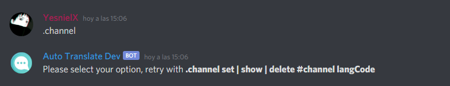

# Channels

## Channels Configuration

Run the command **`.channel`** to get a short information about this command

```
.channel
```



To configure a channel use the **set** parameter, this requires 2 arguments, #channel LangCode

```
.channel set #channel LangCode
```

.png>)

To delete a language from a channel use the **delete** parameter

```
.channel delete #channel LangCode
```

.png>)

To see the channels that are being translated automatically on your server use the show parameter

```
.channel show
```

.png>)
